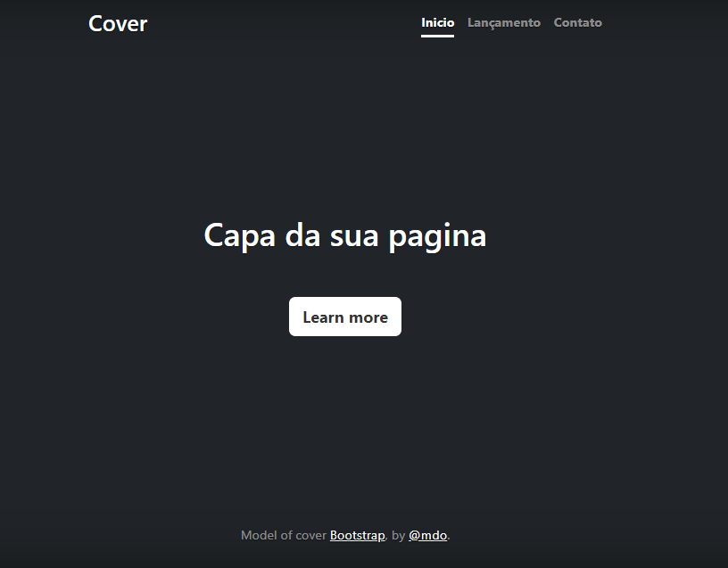

## Ìndicie

[Portifolio Pessoal](#portifolio-pessoal)  
[Descrição](#descrição)  
[Introdução](#introdução)  
[Funcionalidade](#funcionalidade)  
[Tecnologias Utilizadas](#tecnologias-utilizadas)  
[Fontes Consultadas](#fontes-consultadas)  
[Autores](#autores)  

# Portifolio Pessoal

  

## 📚 Descrição

##  Introdução

## :hammer: Funcionalidade

## 💻 Tecnologias Utilizadas

| Linguagens |  📘 Tipo     |
|------------|------------|
| 📄  HTML    |  Marcação  |
|  🖌️  CSS     |  Estilização  |
| 🤖Javascript |   Script   |
|📖 Bootstrap |  Framework  |
|  Git  |    |
|  GitHub|  |
|  VSCode||

## 🌐 Fontes Consultadas

## Autores
